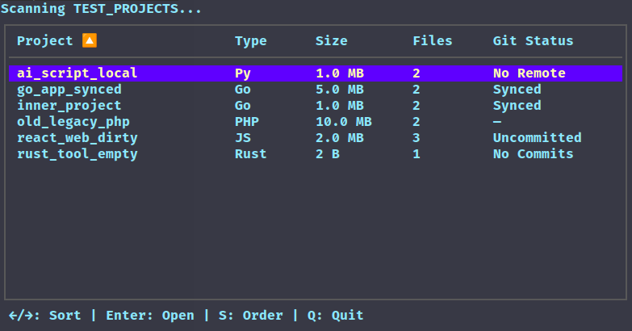

# Launcer Go - Terminal Project Launcher

A sleek, terminal-based project launcher that helps you quickly find and open your projects with an intuitive interface. Built with Go and the Bubble Tea framework, it provides a beautiful TUI (Terminal User Interface) for navigating through your projects.



## Features

- 🚀 **Fast Project Discovery**: Automatically scans directories to find projects based on markers like `.git`, `package.json`, `go.mod`, etc.
- 📊 **Rich Project Information**: Displays project name, type, size, file count, and Git status
- ⌨️ **Intuitive Navigation**: Use arrow keys to navigate, Enter to open projects, and other keyboard shortcuts
- 🗂️ **Smart Sorting**: Sort by any column with left/right arrows, toggle sort order with 'S'
- 🌐 **Cross-Platform**: Works seamlessly on Linux, macOS, and Windows
- 🎨 **Beautiful UI**: Clean, modern interface with color-coded information

## Keyboard Shortcuts

- `←/→` or `h/l`: Navigate between columns to sort by different criteria
- `Enter`: Open the selected project in your default file manager
- `S`: Toggle sort order (ascending/descending)
- `Q`, `Esc`, `Ctrl+C`: Quit the application

## Installation

### Prerequisites

- Go 1.16 or higher

### Install from source

```bash
# Clone the repository
git clone https://github.com/yourusername/launcer_go.git
cd launcer_go

# Install dependencies
go mod tidy

# Build and install
go install
```

### Or run directly

```bash
go run main.go [path]
```

If no path is provided, it will scan the current working directory.

## Usage

```bash
# Scan current directory
launcer_go

# Scan specific directory
launcer_go /path/to/directory
```

## Supported Project Types

The launcher automatically detects project types based on the presence of these files/directories:
- **Git**: `.git` directory
- **JavaScript/Node.js**: `package.json`
- **Go**: `go.mod`
- **Python**: `requirements.txt` or `pyproject.toml`
- **Rust**: `Cargo.toml`
- **Java**: `pom.xml`
- **PHP**: `composer.json`

## Git Status Information

The launcher provides smart Git status detection:
- `Synced`: Repository is clean and has a remote
- `Uncommitted`: Repository has uncommitted changes
- `No Remote`: Repository exists but has no remote configured
- `No Commits`: Repository exists but has no commits yet
- `—`: Not a Git repository

## Project Structure

```
launcer_go/
├── main.go          # Main application logic
├── go.mod           # Go module definition
├── go.sum           # Go module checksums
└── images/          # Project screenshots
    └── working_result.png
```

## Contributing

1. Fork the repository
2. Create a feature branch (`git checkout -b feature/amazing-feature`)
3. Commit your changes (`git commit -m 'Add some amazing feature'`)
4. Push to the branch (`git push origin feature/amazing-feature`)
5. Open a Pull Request

## License

This project is licensed under the MIT License - see the [LICENSE](LICENSE) file for details.

## Acknowledgments

- Built with [Bubble Tea](https://github.com/charmbracelet/bubbletea) - A powerful TUI framework
- Styled with [Lip Gloss](https://github.com/charmbracelet/lipgloss) - A declarative styling system
- Inspired by the need for a fast, terminal-based project launcher